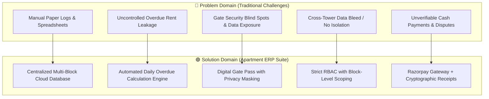
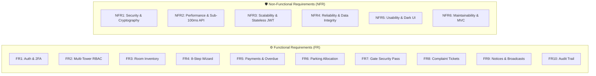
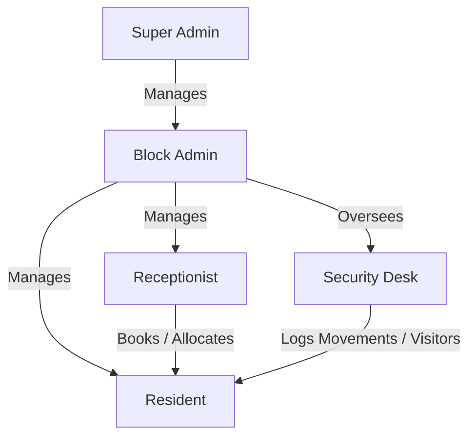
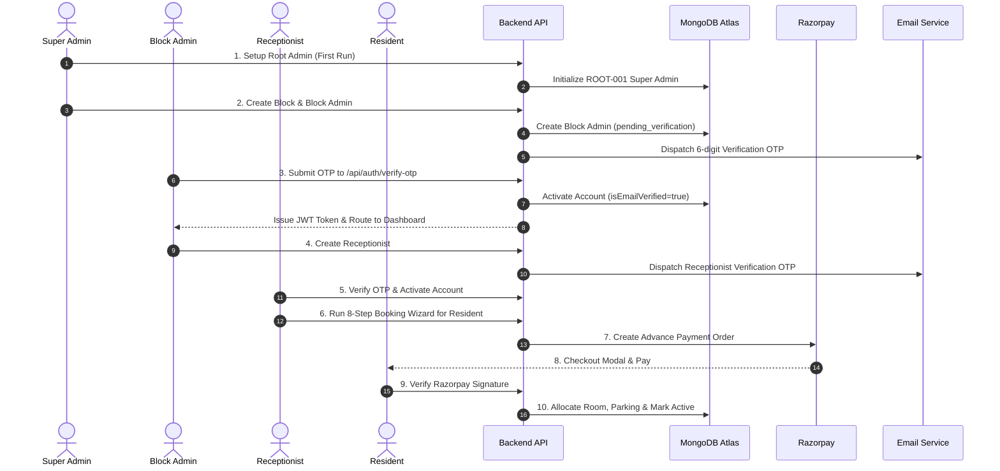
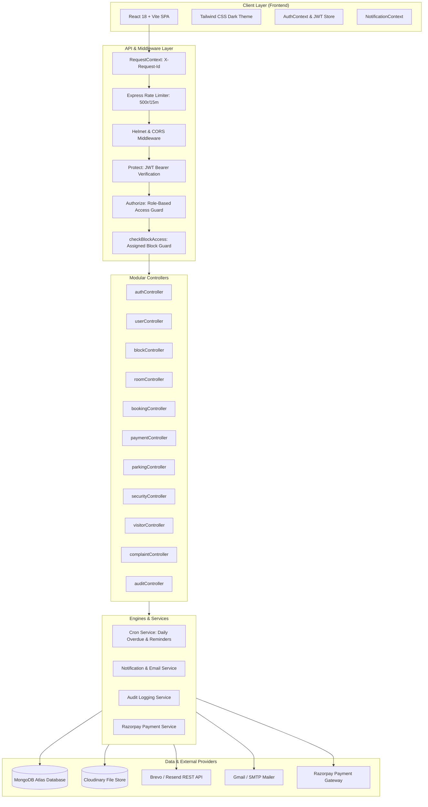
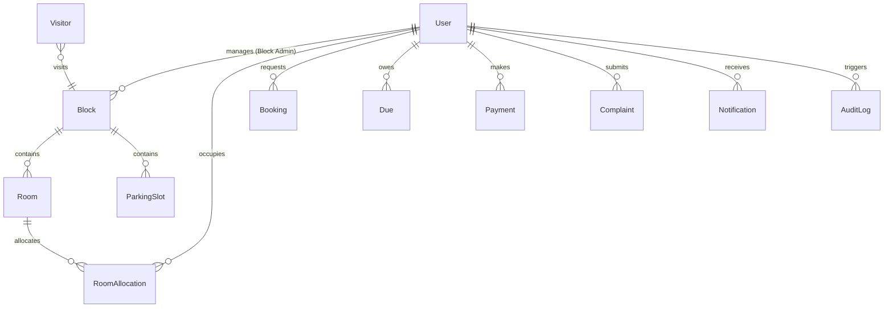
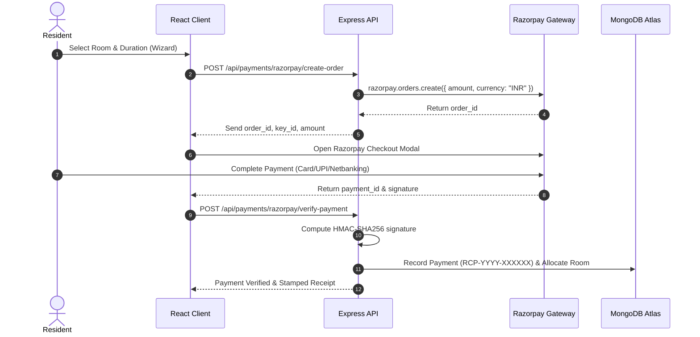

# 🏢 Enterprise Apartment Management System (RBAC Suite)

A production-ready, full-stack, enterprise-grade **Apartment Management System** designed to automate and digitize residential community operations. The platform delivers role-based access control (RBAC), multi-block isolation, automated room booking with dynamic advance rules, automated late fee and overdue tracking engines, cryptographic two-factor authentication, Razorpay payment processing, visitor gate security, and maintenance ticket tracking.

---

## 📑 Table of Contents

1. [Project Overview](#1-project-overview)
2. [Problem Analysis & Engineering Scope](#2-problem-analysis--engineering-scope)
   - [2.1 Problem Statement](#21-problem-statement)
   - [2.2 Problem Scope](#22-problem-scope)
   - [2.3 Problem Domain](#23-problem-domain)
   - [2.4 Solution Domain](#24-solution-domain)
3. [System Requirements Specification (SRS)](#3-system-requirements-specification-srs)
   - [3.1 Functional Requirements (FR)](#31-functional-requirements-fr)
   - [3.2 Non-Functional Requirements (NFR)](#32-non-functional-requirements-nfr)
4. [Technology Stack](#4-technology-stack)
5. [System Roles & RBAC Access Matrix](#5-system-roles--rbac-access-matrix)
6. [Complete System Workflow](#6-complete-system-workflow)
7. [System Flow](#7-system-flow)
8. [System Architecture](#8-system-architecture)
9. [Complete API Documentation](#9-complete-api-documentation)
10. [API Request/Response Flow](#10-api-requestresponse-flow)
11. [Authentication & Security Architecture](#11-authentication--security-architecture)
12. [Database Architecture & Data Models](#12-database-architecture--data-models)
13. [Redis & Caching Architecture](#13-redis--caching-architecture)
14. [Payment Architecture & Gateway Integration](#14-payment-architecture--gateway-integration)
15. [Email & Notification Delivery System](#15-email--notification-delivery-system)
16. [Shop & Service Provider System](#16-shop--service-provider-system)
17. [Frontend Architecture](#17-frontend-architecture)
18. [Backend Architecture](#18-backend-architecture)
19. [Error Handling & Structured Logging](#19-error-handling--structured-logging)
20. [Deployment Guide](#20-deployment-guide)
21. [Environment Variables](#21-environment-variables)
22. [Project Structure](#22-project-structure)
23. [Installation & Local Setup](#23-installation--local-setup)
24. [API Examples (cURL)](#24-api-examples-curl)
25. [UI Showcase & Dashboards](#25-ui-showcase--dashboards)
26. [Future Enhancements](#26-future-enhancements)
27. [Contributors & Author](#27-contributors--author)

---

# 1. Project Overview

### 🏷️ Project Name
**Enterprise Apartment Management System (RBAC Suite)**

### 📖 Detailed Description
The Apartment Management System provides an all-in-one residential community ERP platform that connects **Super Administrators, Block Administrators, Front Desk Receptionists, Residents, and Security Personnel**. The system replaces disjointed spreadsheets, paper visitor logs, and manual payment tracking with a secure, automated digital workflow.

### 🎯 Purpose of the System
To provide a unified, multi-tenant digital hub that automates apartment allocations, recurring rent collections, visitor gate passes, complaint resolution, and administrative audits across complex multi-block residential towers.

### 🛑 Problems It Solves
- **Manual Spreadsheet Inefficiencies:** Eliminates manual record-keeping for room inventory, tenant verification, and vehicle parking allocations.
- **Overdue Rent Leakage:** Automates late fee computations across color-coded overdue tiers (Orange, Red, Dark Red) with automated daily cron recalculations.
- **Front Desk Bottlenecks:** Provides an 8-step booking wizard enforcing business constraints (e.g. maximum 4 rooms per resident, 60% vs. 4 months' advance rent calculation).
- **Gate Security Blind Spots:** Replaces manual registers with a digital check-in/out engine that logs visitor details, vehicles, and stay durations while strictly masking resident private data.
- **Lack of Auditing:** Maintains an immutable audit trail (`AuditLog`) capturing all administrative actions with IP addresses, user agents, and entity snapshots.

### 🌟 Key Highlights
- **Zero-Data First Run Detection:** Auto-detects empty database state and routes the initial user to create the root Super Admin (`ROOT-001`).
- **Cryptographic 2FA Authentication:** All authentication OTPs are SHA-256 hashed and verified using constant-time comparisons (`crypto.timingSafeEqual`).
- **Seamless Staff Onboarding:** New Admins and Receptionists verify via email OTP and proceed directly to portal activation without mandatory password creation.
- **Razorpay Integration:** Full order creation, client checkout modal, and HMAC-SHA256 signature verification with automated receipt generation (`RCP-YYYY-XXXXXX`).
- **Production Error Masking:** Central error handler logs detailed stack traces internally while returning user-safe responses (`"Something went wrong. Please try again later."`).

---

# 2. Problem Analysis & Engineering Scope



### 2.1 Problem Statement
Modern residential apartment complexes and multi-tower societies face significant operational friction due to disjointed, manual, and paper-based management processes:

1. **Financial Leakage & Manual Calculation Errors:** Property managers struggle with tracking recurring rental dues, calculating late fees across aging debt tiers, and reconciling manual cash receipts, leading to lost revenue and accounting disputes.
2. **Security Vulnerabilities & Visitor Mismanagement:** Traditional paper visitor logs at security gates fail to capture accurate entry/exit timestamps, do not compute duration of stay, and unnecessarily expose residents' personal phone numbers and private details to visitors.
3. **Operational Bottlenecks in Tenant Onboarding:** Front desk receptionists lack structured booking workflows to verify tenant KYC documents, enforce room allocation limits, and calculate dynamic advance security deposits.
4. **Lack of Multi-Tower Data Isolation:** Without role-based access control (RBAC) and tower-level data scoping, administrative staff from one block can inadvertently view, modify, or tamper with records belonging to other residential blocks.
5. **Absence of Accountability & Audit Trails:** When room allocations change, rent discounts are applied, or maintenance tickets are resolved, there is no immutable audit log tracking who performed the action, from which IP address, and at what timestamp.

---

### 2.2 Problem Scope

#### 🟢 In-Scope (Delivered by the Platform)
- **Multi-Tower Governance:** Hierarchical administration spanning Global Super Admins, Block Admins, Front Desk Receptionists, Security Personnel, and Residents.
- **Role-Based Access Control (RBAC):** Strict role authorization and data partitioning ensuring Block Admins and Receptionists access only their assigned tower (`assignedBlock`).
- **Tenant Lifecycle Management:** Self-registration, front-desk onboarding, KYC document verification, room allocation (max 4 rooms/resident), and checkout procedures.
- **Dynamic Advance Rent Rules:** Automatic mathematical computation of required security advance based on lease duration ($60\%$ advance for $\le 6$ months; $4$ months' rent for $> 6$ months).
- **Automated Overdue Escalation Engine:** Daily scheduled background cron recalculating late fees across 3 distinct color-coded tiers (Orange, Red, Dark Red).
- **Online & Offline Payment Processing:** Razorpay payment gateway integration with HMAC-SHA256 signature verification and manual cash entry recording with stamped PDF receipts (`RCP-YYYY-XXXXXX`).
- **Gate Security & Visitor Tracking:** Digital visitor pass issuance, stay duration calculator, restricted resident directory lookup (phone/ID masked), and resident movement logging.
- **Maintenance & Helpdesk Ticketing:** Complaint logging with priority tags, status progression tracking (`pending` $\rightarrow$ `in_progress` $\rightarrow$ `resolved`), and resolution history.
- **Two-Factor Authentication & Security:** SHA-256 hashed OTPs, constant-time comparisons, bcrypt password hashing, and sanitized production error masking.
- **Immutable Audit Logging:** System-wide capture of critical administrative events with actor ID, entity ID, previous/new values, IP addresses, and user agents.

#### 🔴 Out-of-Scope (Future / External Boundaries)
- Direct integration with smart biometric hardware / turnstile gates (handled via manual security portal entry).
- Automated banking reconciliation feeds (handled via Razorpay webhooks and manual payment entries).
- Native mobile applications on iOS/Android app stores (fully responsive web application provided).

---

### 2.3 Problem Domain
The residential property management domain encompasses operational, financial, and security functions within high-density housing societies:
- **Hierarchical Tenancy:** Properties are partitioned into Blocks/Towers $\rightarrow$ Floors $\rightarrow$ Rooms/Flats $\rightarrow$ Parking Bays.
- **Lease Compliance:** Rent dues follow fixed billing cycles, with penalties applied progressively as overdue duration increases.
- **Gatekeeper Logistics:** High volume of external visitors (guests, delivery agents, service contractors) requiring quick, privacy-safe identity logging.
- **Multi-Role Coordination:** Distinct operational personas requiring tailored interfaces without privilege escalation or data bleed.

---

### 2.4 Solution Domain
The solution implements a cloud-native, three-tier model-view-controller (MVC) single-page application (SPA) architecture:
- **Presentation Layer:** Reactive React 18 frontend with Tailwind CSS dark UI, dynamic role-based layouts, and responsive 8-step booking workflows.
- **Application & API Layer:** Node.js / Express REST API enforcing request context tracking (`X-Request-Id`), rate limiting, Helmet security headers, JWT authentication, and block-scoping middleware.
- **Business Engine Layer:** Automated background cron workers executing late fee mathematics, notification dispatchers utilizing HTTPS REST email APIs (Brevo/Resend) and SMTP relays, and cryptographic signature validators.
- **Data Persistence Layer:** MongoDB Atlas NoSQL database with 16 normalized Mongoose schemas, indexed compound queries, and Cloudinary media storage for tenant KYC documents.

---

# 3. System Requirements Specification (SRS)



### 3.1 Functional Requirements (FR)

| Requirement ID | Module / Feature Area | Functional Specification |
|---|---|---|
| **FR-AUTH-01** | Zero-Data Initialization | System must inspect database upon startup; if zero Super Admins exist, `GET /api/auth/setup-status` returns `setupRequired: true`, allowing the first operator to initialize root admin `ROOT-001`. |
| **FR-AUTH-02** | 2-Step Login with 2FA | User submits identifier (email/mobile) and password. System validates credentials, generates a 6-digit cryptographic OTP, hashes it using SHA-256, dispatches it to the registered email, and issues a short-lived `verificationToken`. Upon OTP submission, system issues a 7-day JWT token. |
| **FR-AUTH-03** | Password Recovery | User requests password reset by submitting registered email or mobile. System generates a 6-digit reset OTP with a 10-minute expiry and 60-second cooldown. Once verified, a signed `resetToken` allows updating the password. |
| **FR-AUTH-04** | Staff Zero-Password Activation | When Super Admin or Block Admin creates staff (Block Admin / Receptionist), the account is initialized in `pending_verification` status. Staff verifies via a 6-digit email OTP (or 1-click email link) and gains immediate access to the dashboard. |
| **FR-RBAC-01** | Role-Based Access Control | System must strictly enforce permissions across 5 roles: `super_admin`, `block_admin`, `receptionist`, `resident`, `security`. Unauthorized endpoints return HTTP 403 Forbidden. |
| **FR-RBAC-02** | Multi-Block Tower Isolation | Block Admins and Receptionists are strictly scoped to their `assignedBlock`. Queries automatically filter by `blockId`, preventing access to data belonging to other towers. |
| **FR-RBAC-03** | Receptionist Quota Guard | System enforces a business rule limiting each block to a maximum of **2 active Receptionists**. |
| **FR-ROOM-01** | Block & Room Inventory | Super Admin creates blocks with defined floors and room numbers. Block Admins create and manage rooms (1BHK, 2BHK, 3BHK, Studio, Penthouse) with base rent, deposit, capacity, and amenities. |
| **FR-ROOM-02** | Real-Time Availability Filter | Public and authenticated users can query `GET /api/rooms/available` with block, floor, and rent filters to view rooms with `status: 'available'`. |
| **FR-BOOK-01** | 8-Step Booking Wizard | Front desk receptionists and residents execute an 8-step guided booking flow: (1) Tenant Search/Register $\rightarrow$ (2) Stay Duration $\rightarrow$ (3) Occupant Details $\rightarrow$ (4) KYC Upload $\rightarrow$ (5) Room Selection (Max 4) $\rightarrow$ (6) Advance Calculation $\rightarrow$ (7) Parking Bay $\rightarrow$ (8) Confirmation & Receipt. |
| **FR-BOOK-02** | Allocation Constraint Limit | A single resident profile is constrained to holding a **maximum of 4 active room allocations** simultaneously across the complex. |
| **FR-PAY-01** | Dynamic Advance Rent Rules | For lease durations $\le 6$ months, advance rent is calculated as: $$\text{Advance} = 0.60 \times \text{Monthly Rent}$$ For lease durations $> 6$ months, advance rent is calculated as: $$\text{Advance} = 4 \times \text{Monthly Rent}$$ |
| **FR-PAY-02** | Razorpay Gateway Processing | System creates server-side Razorpay orders (`amount`, `currency: 'INR'`) and verifies HMAC-SHA256 signatures upon payment completion before updating allocation and due statuses. |
| **FR-PAY-03** | Manual Cash/Bank Entry | Receptionists and Admins can record offline cash, cheque, or direct bank transfer payments, capturing payer details, transaction reference, and issuing stamped printable receipts. |
| **FR-PAY-04** | Unique Stamped Receipts | Every successful transaction generates an immutable receipt with a unique identifier formatted as `RCP-YYYY-XXXXXX`. |
| **FR-DUE-01** | Automated Overdue Cron Engine | A background cron job executes daily at 00:00 UTC to evaluate unpaid dues and dynamically calculate late fee penalties across 3 overdue tiers: <br>• **Tier 1 (Orange, 1–10 Days):** $\text{Late Fee} = \min(500, \text{days} \times 50)$<br>• **Tier 2 (Red, 11–30 Days):** $\text{Late Fee} = 500 + (\text{days} - 10) \times 75$<br>• **Tier 3 (Dark Red, >30 Days):** $\text{Late Fee} = 2000 + (\text{days} - 30) \times 100$ |
| **FR-PARK-01** | Parking Bay Allocation | Admins manage parking slots (Standard, 4-Wheeler, Compact, EV Charging). Slots can be allocated to residents with assigned vehicle numbers and vehicle types. |
| **FR-SEC-01** | Digital Visitor Check-In/Out | Security desk checks in visitors with host flat number, visitor name, phone number, vehicle number, and purpose. Check-out updates departure timestamp and calculates exact stay duration. |
| **FR-SEC-02** | Privacy-Masked Resident Lookup | Security desk can lookup resident flat numbers and authorized vehicle registrations while phone numbers, emails, financial dues, and KYC documents remain strictly masked. |
| **FR-SEC-03** | Resident Gate Movement Logging | Security logs resident vehicle/pedestrian entries and exits to maintain real-time on-premises occupancy logs. |
| **FR-COMP-01** | Maintenance Helpdesk Ticketing | Residents submit maintenance or parking complaints with category, priority, description, and photo attachments. Admins update ticket status (`pending`, `in_progress`, `resolved`). |
| **FR-NOTIF-01** | Announcements & Notices | Admins publish society-wide or block-specific broadcast notices with priority flags (`normal`, `urgent`, `critical`). |
| **FR-NOTIF-02** | Multi-Channel Notifications | System dispatches in-app bell notifications and responsive HTML emails for booking confirmations, OTP verifications, payment receipts, and overdue notices. |
| **FR-AUDIT-01** | Immutable Audit Trail | All state-altering administrative actions (user updates, payment creations, manual allocations, status overrides) are recorded in `auditlogs` with actor ID, entity ID, previous/new value diffs, IP address, and user agent. |

---

### 3.2 Non-Functional Requirements (NFR)

#### 🔒 NFR-1: Security & Cryptography
- **Password Protection:** Passwords hashed using `bcryptjs` with **10 cryptographic salt rounds**. Plaintext passwords are never persisted or logged.
- **Timing-Safe OTP Verification:** One-time passcodes are hashed using **SHA-256** and verified via `crypto.timingSafeEqual` buffers to eliminate timing side-channel attacks.
- **Stateless Tokens:** JSON Web Tokens signed with HMAC-SHA256 (`JWT_SECRET`) and enforced with a 7-day expiration lifespan.
- **HTTP Header Hardening:** `helmet` middleware sets secure headers including `X-Content-Type-Options: nosniff`, `X-Frame-Options: SAMEORIGIN`, and XSS filtering.
- **Rate Limiting:** IP-based sliding window rate limiter restricts traffic to **500 requests per 15 minutes** per IP address to mitigate brute-force and DDoS vectors.
- **Sensitive Payload Masking:** Centralized logger automatically sanitizes credit cards, CVVs, passwords, JWT tokens, and OTP codes before emitting to console or log streams.

#### ⚡ NFR-2: Performance & Latency
- **API Response Latency:** 95% of standard CRUD read/write API requests complete within **$< 120\text{ ms}$**.
- **Non-Blocking Email Dispatch:** Email sending executes asynchronously in the background via HTTPS REST APIs (Brevo / Resend) with strict **4-second socket timeouts**, ensuring the HTTP client response is returned in **$< 80\text{ ms}$**.
- **Asset Optimization:** Frontend bundled with Vite, achieving tree-shaken chunks with Gzip compression ($< 400\text{ kB}$ vendor bundle) and initial paint times of **$< 1.2\text{ s}$**.
- **Database Query Indexing:** Compound indexes on frequently filtered fields (`assignedBlock`, `roomNumber`, `status`, `dueDate`) ensure index-covered scans for high-volume endpoints.

#### 📈 NFR-3: Scalability & High Availability
- **Stateless Backend Architecture:** Express server instances store zero in-memory session state, allowing seamless horizontal scaling behind load balancers.
- **Cloud-Native Database:** Managed MongoDB Atlas cluster provides automated replication, failover, continuous backups, and vertical/horizontal sharding capabilities.
- **Media Offloading:** All image assets (KYC identity documents, receipt stamps) are offloaded directly to Cloudinary CDN, minimizing application server bandwidth consumption.

#### 🛡️ NFR-4: Reliability & Data Integrity
- **Transactional Consistency:** Payment verification and room allocation execute sequentially with atomic status updates, preventing double allocation under concurrent checkout.
- **Idempotent Payment Handling:** Unique sparse indexing on `paymentId` and `receiptNumber` guarantees that network retries cannot produce duplicate payment records or ledger entries.
- **Resilient MongoDB Auto-Reconnect:** Mongoose client is configured with auto-reconnect listeners and SSL/TLS socket validation (`retryWrites=true`).

#### 🎨 NFR-5: Usability, Accessibility & Design
- **Responsive Dark Theme:** Consistent slate/indigo design system crafted with Tailwind CSS, supporting mobile (360px), tablet (768px), and high-resolution desktop screens (1920px+).
- **Guided Workflows:** Complex operations (such as tenant onboarding and room allocation) utilize step-by-step wizard interfaces with live client-side validation and feedback.
- **Accessibility & A11y:** Form controls implement semantic HTML5 elements with appropriate `autoComplete`, `inputMode`, `aria-label`, and high-contrast color ratios.

#### 🔧 NFR-6: Maintainability, Modularity & Observability
- **Clean Layered MVC Architecture:** Strict separation of concerns between Routes $\rightarrow$ Middleware $\rightarrow$ Controllers $\rightarrow$ Services $\rightarrow$ Data Models.
- **Correlation Request Tracking:** Every incoming HTTP request is assigned a unique UUID (`req.id`), passed through the `X-Request-Id` response header for end-to-end tracing.
- **Operational Error Classification:** Custom `AppError` class differentiates between operational errors (4xx client errors) and unhandled programmatic exceptions (500 internal errors).

---

# 4. Technology Stack

### 💻 Frontend
| Technology / Library | Version | Purpose in Application |
|---|---|---|
| **React** | `^18.3.1` | Core UI framework for component-based reactive dashboard interfaces. |
| **Vite** | `^6.4.3` | High-performance build tool, dev server, and production bundler. |
| **Tailwind CSS** | `^3.4.1` | Utility-first styling framework for responsive dark-themed UI components. |
| **Lucide React** | `^0.344.0` | Comprehensive iconography set for navigation, status badges, and actions. |
| **Axios** | `^1.6.7` | HTTP client with centralized interceptors for JWT authorization headers and error handling. |
| **React Router DOM** | `^6.22.3` | Client-side routing, protected routes, and role-based redirect guards. |
| **Canvas Confetti** | `^1.9.4` | Visual celebration effects upon booking and payment completion. |
| **HTML2Canvas & DOMPurify** | `^1.4.1` / `^3.2.4` | Stamped payment receipt export and XSS sanitization. |

### ⚙️ Backend
| Technology / Library | Version | Purpose in Application |
|---|---|---|
| **Node.js** | `v18+` / `v20+` | Server-side JavaScript runtime environment. |
| **Express.js** | `^4.18.3` | RESTful API server framework with modular routing and middleware chaining. |
| **Mongoose** | `^8.2.1` | MongoDB Object Data Modeling (ODM) library for schema validation, hooks, and queries. |
| **JSON Web Token (jsonwebtoken)** | `^9.0.2` | Stateless authentication tokens signed with HMAC-SHA256 and 7-day expiration. |
| **bcryptjs** | `^2.4.3` | One-way password hashing using 10 cryptographic salt rounds. |
| **Razorpay SDK** | `^2.9.2` | Official payment gateway integration for order creation and verification. |
| **Nodemailer** | `^6.9.10` | SMTP email client for transactional notifications, OTPs, and welcome emails. |
| **Cloudinary** | `^2.0.3` | Cloud image and document storage for tenant identity proofs and attachments. |
| **Multer** | `^1.4.5-lts.1` | Multipart form-data middleware for handling file uploads. |
| **Node-Cron** | `^3.0.3` | Background task scheduling for automated daily overdue calculations and due reminders. |
| **Helmet** | `^7.1.0` | Security headers middleware for HTTP request protection. |
| **Express Rate Limit** | `^7.1.5` | IP-based request rate limiting (500 requests per 15 minutes). |
| **Morgan** | `^1.10.0` | HTTP request logger for development debugging. |
| **Dotenv** | `^16.4.5` | Environment variable management across local and production environments. |

---

# 5. System Roles & RBAC Access Matrix

The system implements **5 core operational roles** with strict Role-Based Access Control (RBAC):



| Role | Purpose | Key Permissions | Restrictions |
|---|---|---|---|
| **Super Admin** (`super_admin`) | System Owner & Global Controller | Global Block CRUD, Block Admin CRUD, Global Room & Parking oversight, Audit logs, Financial revenue reports. | Cannot be deleted if sole Super Admin. |
| **Block Admin** (`block_admin`) | Manager of a Specific Block Tower | Receptionist management (max 2/block), Room inventory CRUD within block, Parking allocation within block, Complaints resolution, Notice broadcasting, Overdue revenue dashboard. | Scoped strictly to assigned block (`assignedBlock`). Cannot view or modify data of other blocks. |
| **Receptionist** (`receptionist`) | Front Desk Operations & Onboarding | Resident registration, 8-Step Room Booking Wizard, Manual cash/bank payment recording, Stamped receipt generation, Visitor check-in/out. | Cannot create blocks, modify base rent rules, or access system audit logs. |
| **Resident** (`resident`) | Apartment Tenant / Owner | View room allocation, Browse & book available rooms, Request parking slots, Pay rent/dues online via Razorpay, Submit maintenance complaints, Download PDF receipts. | Read-only access to own allocations, dues, and notices. Cannot view other residents' details. |
| **Security Desk** (`security`) | Gatekeeper & Visitor Security | Visitor check-in (with vehicle & purpose), Visitor check-out (duration calculation), Resident movement logging (In/Out), Restricted resident directory lookup. | Strictly masked view: cannot view resident financial data, ID proofs, or contact credentials. |

---

# 6. Complete System Workflow



### Detailed Flow Descriptions:
1. **First-Time Super Admin Setup:** When `superAdminCount === 0`, `GET /api/auth/setup-status` returns `setupRequired: true`, guiding the operator to `/setup` to initialize `ROOT-001`.
2. **Staff Onboarding Without Password Creation:** Newly created Block Admins and Receptionists are registered in `pending_verification` status with `mustChangePassword = false`. They verify via a 6-digit email OTP (or 1-click email link) and are immediately authenticated and routed to portal operations without forced password setup.
3. **8-Step Room Booking Wizard:**
   - *Step 1 (Lookup):* Search resident by mobile/email or register a new profile.
   - *Step 2 (Duration):* Select stay dates and duration in months.
   - *Step 3 (Occupants):* Enter primary tenant and co-occupant information.
   - *Step 4 (KYC Documents):* Upload identity proofs (Aadhaar, Passport, etc.).
   - *Step 5 (Room Selection):* Select up to **maximum 4 rooms** with real-time availability filters.
   - *Step 6 (Advance Calculation):* Computes **60% advance rent for $\le 6$ months** or **4 months' advance rent for $>6$ months**.
   - *Step 7 (Parking Bay):* Optional allocation of standard or 4-wheeler parking slot.
   - *Step 8 (Confirmation & Receipt):* Generates stamped printable PDF receipt (`RCP-YYYY-XXXXXX`).
4. **Automated Overdue Tier Calculation Engine:** Daily midnight cron job evaluates all open dues:
   - **1–10 Days Overdue:** **ORANGE** ($\text{Late Fee: } \min(500, \text{days} \times 50)$)
   - **>10 Days Overdue:** **RED** ($\text{Late Fee: } 500 + (\text{days} - 10) \times 75$)
   - **>30 Days Overdue (Critical):** **DARK RED** ($\text{Late Fee: } 2000 + (\text{days} - 30) \times 100$)
5. **Visitor Gate Management:** Security desk checks in visitors with host flat details, visitor vehicle numbers, and captures entry timestamps. Upon departure, checkout computes the exact stay duration.

---

# 7. System Flow

```text
                               ┌─────────────────────────┐
                               │       Client User       │
                               └────────────┬────────────┘
                                            │
                                            ▼
                               ┌─────────────────────────┐
                               │  React Frontend (Vite)  │
                               └────────────┬────────────┘
                                            │ HTTP / HTTPS (Axios)
                                            ▼
                               ┌─────────────────────────┐
                               │ Express Request Context │
                               │  (Generate RequestId)   │
                               └────────────┬────────────┘
                                            │
                                            ▼
                               ┌─────────────────────────┐
                               │   Security Middleware   │
                               │ (Helmet, CORS, RateLim) │
                               └────────────┬────────────┘
                                            │
                                            ▼
                               ┌─────────────────────────┐
                               │ Authentication & RBAC   │
                               │ (JWT + Block Scoping)   │
                               └────────────┬────────────┘
                                            │
                                            ▼
                               ┌─────────────────────────┐
                               │   Modular Controllers   │
                               └──────┬────────────┬─────┘
                                      │            │
                         ┌────────────┘            └────────────┐
                         ▼                                      ▼
             ┌───────────────────────┐              ┌───────────────────────┐
             │  Business Services    │              │  External Services    │
             │  - Notification Engine│              │  - Razorpay Gateway   │
             │  - Overdue Cron Engine│              │  - Brevo / Resend API │
             │  - Audit Logger       │              │  - Cloudinary Storage │
             └───────────┬───────────┘              └───────────────────────┘
                         │
                         ▼
             ┌───────────────────────┐
             │  Mongoose ODM Layer   │
             └───────────┬───────────┘
                         │
                         ▼
             ┌───────────────────────┐
             │  MongoDB Atlas Cluster│
             └───────────────────────┘
```

---

# 8. System Architecture



---

# 9. Complete API Documentation

### 🔐 Authentication & Identity APIs (`/api/auth`)
| Method | Endpoint | Authorized Roles | Description |
|---|---|---|---|
| `GET` | `/setup-status` | Public | Checks if system requires initial root Super Admin creation. |
| `POST` | `/initial-setup` | Public (First run) | Creates root Super Admin account (`ROOT-001`). |
| `POST` | `/login` | Public | Step 1 login: verifies credentials and dispatches 6-digit 2FA email OTP. |
| `POST` | `/verify-login-otp` | Public | Step 2 login: validates login OTP and returns JWT token + user profile. |
| `POST` | `/resend-login-otp` | Public | Resends 6-digit login 2FA OTP with 60s cooldown. |
| `POST` | `/register` | Public | Self-registration for residents with automatic email OTP generation. |
| `POST` | `/verify-otp` | Public | Verifies account OTP and issues JWT session without forced password creation. |
| `POST` | `/activate-account` | Public | 1-click email activation link handler. |
| `POST` | `/resend-otp` | Public | Resends account activation OTP. |
| `POST` | `/setup-password` | Public | Optional password setup for verified accounts. |
| `POST` | `/forgot-password` | Public | Dispatches password reset 6-digit OTP to registered email. |
| `POST` | `/verify-reset-otp` | Public | Validates password reset OTP and issues reset token. |
| `POST` | `/reset-password-otp`| Public | Resets user password using verified reset token. |
| `GET` | `/me` | Authenticated | Fetches current user profile and role details. |
| `PUT` | `/profile` | Authenticated | Updates current user's profile details. |
| `POST` | `/change-password` | Authenticated | Changes user password using current password verification. |
| `POST` | `/force-change-password`| Authenticated | Handles mandatory password change when `mustChangePassword = true`. |

### 🏢 Block Management APIs (`/api/blocks`)
| Method | Endpoint | Authorized Roles | Description |
|---|---|---|---|
| `GET` | `/` | Authenticated | Retrieves list of all active blocks (scoped for Block Admins). |
| `GET` | `/:id` | Authenticated | Retrieves detailed block profile by ID. |
| `POST` | `/` | `super_admin` | Creates a new block with total floors, rooms, and parking slots. |
| `PUT` | `/:id` | `super_admin` | Updates block metadata and assigned block admin. |
| `DELETE` | `/:id` | `super_admin` | Soft deletes block. |

### 🛏️ Room & Allocation APIs (`/api/rooms`)
| Method | Endpoint | Authorized Roles | Description |
|---|---|---|---|
| `GET` | `/available` | Public / Authenticated| Retrieves only rooms currently available for booking. |
| `GET` | `/` | Authenticated | Lists all rooms with filtering by block, type, and status. |
| `GET` | `/:id` | Authenticated | Retrieves room details by ID. |
| `POST` | `/` | `super_admin`, `block_admin` | Creates a new room under a specific block. |
| `PUT` | `/:id` | `super_admin`, `block_admin` | Updates room rent, capacity, amenities, or status. |
| `POST` | `/:id/allocate` | `super_admin`, `block_admin`, `receptionist` | Manually allocates room to resident. |
| `DELETE` | `/:id` | `super_admin`, `block_admin` | Soft deletes room from inventory. |

### 👥 User & Staff Management APIs (`/api/users`)
| Method | Endpoint | Authorized Roles | Description |
|---|---|---|---|
| `GET` | `/` | Authenticated | Lists users with role and status filtering. |
| `POST` | `/` | `super_admin`, `block_admin`, `receptionist` | Front desk resident registration. |
| `GET` | `/search` | Authenticated | Searches users by name, mobile, email, or registration ID. |
| `GET` | `/block-admins` | `super_admin` | Lists all Block Administrators with assigned blocks. |
| `POST` | `/block-admin` | `super_admin` | Creates Block Admin and dispatches verification OTP email. |
| `POST` | `/block-admin/:id/resend-otp` | `super_admin` | Resends verification OTP to Block Admin. |
| `PUT` | `/block-admin/:id/email` | `super_admin` | Updates Block Admin email and resends verification OTP. |
| `POST` | `/resident` | `super_admin`, `block_admin`, `receptionist` | Registers resident profile. |
| `GET` | `/:id` | Authenticated | Fetches user profile by ID. |
| `POST` | `/:id/verify-document` | `super_admin`, `block_admin` | Marks resident KYC identity document as verified. |

### 📅 Booking & Queue APIs (`/api/bookings`)
| Method | Endpoint | Authorized Roles | Description |
|---|---|---|---|
| `POST` | `/` | Authenticated | Creates room booking (enforcing max 4 rooms limit). |
| `GET` | `/` | Authenticated | Retrieves resident bookings or block booking list. |
| `POST` | `/queue` | Authenticated | Joins booking queue for fully occupied room types. |
| `GET` | `/queue` | Authenticated | Retrieves booking queue position. |
| `GET` | `/:id` | Authenticated | Retrieves booking details by ID. |

### 💳 Payment & Dues APIs (`/api/payments`)
| Method | Endpoint | Authorized Roles | Description |
|---|---|---|---|
| `POST` | `/razorpay/create-order` | Authenticated | Generates Razorpay order for room advance or due payment. |
| `POST` | `/razorpay/verify-payment` | Authenticated | Validates HMAC-SHA256 Razorpay signature and confirms booking. |
| `POST` | `/manual` | `super_admin`, `block_admin`, `receptionist` | Records cash/cheque/bank payment and generates stamped receipt. |
| `POST` | `/` | Authenticated | Processes resident direct payment. |
| `GET` | `/revenue` | `super_admin`, `block_admin`, `receptionist` | Aggregated revenue metrics and collection statistics. |
| `GET` | `/overdue-dashboard` | `super_admin`, `block_admin`, `receptionist` | Color-coded overdue dashboard (Orange/Red/Dark Red tiers). |
| `GET` | `/` | Authenticated | Lists payments with pagination and status filters. |
| `GET` | `/:id` | Authenticated | Retrieves payment and invoice details by ID. |

### 🚗 Parking Management APIs (`/api/parking`)
| Method | Endpoint | Authorized Roles | Description |
|---|---|---|---|
| `GET` | `/` | Authenticated | Lists parking slots with availability status. |
| `POST` | `/` | `super_admin`, `block_admin` | Adds new parking slot to block. |
| `PUT` | `/:id` | `super_admin`, `block_admin` | Updates parking slot status or vehicle type. |
| `POST` | `/:id/allocate` | `super_admin`, `block_admin`, `receptionist` | Allocates parking slot to resident. |
| `DELETE` | `/:id` | `super_admin`, `block_admin` | Deletes parking slot. |

### 🛎️ Receptionist Management APIs (`/api/receptionists`)
| Method | Endpoint | Authorized Roles | Description |
|---|---|---|---|
| `GET` | `/` | `super_admin`, `block_admin` | Lists receptionists (max 2 per block enforced). |
| `POST` | `/` | `super_admin`, `block_admin` | Creates receptionist and dispatches verification OTP email. |
| `DELETE` | `/:id` | `super_admin`, `block_admin` | Deactivates or removes receptionist. |

### 🚪 Visitor & Gate APIs (`/api/visitors`)
| Method | Endpoint | Authorized Roles | Description |
|---|---|---|---|
| `GET` | `/` | Authenticated | Lists visitors with date and status filters. |
| `POST` | `/` | `super_admin`, `block_admin`, `receptionist`, `security`, `resident` | Checks in visitor with vehicle and host flat details. |
| `POST` | `/:id/check-out`| `super_admin`, `block_admin`, `receptionist`, `security` | Checks out visitor and records stay duration. |

### 🛡️ Security Desk APIs (`/api/security`)
| Method | Endpoint | Authorized Roles | Description |
|---|---|---|---|
| `GET` | `/lookup-resident` | `super_admin`, `block_admin`, `receptionist`, `security` | Privacy-masked resident lookup (name, room, vehicle only). |
| `POST` | `/resident-movement` | `super_admin`, `block_admin`, `security` | Logs resident entry/exit gate movements. |
| `GET` | `/logs` | `super_admin`, `block_admin`, `security` | Retrieves gate security event logs. |
| `GET` | `/stats` | `super_admin`, `block_admin`, `security` | Gate statistics (visitors inside, movements count). |

### 📝 Complaint & Ticket APIs (`/api/complaints`)
| Method | Endpoint | Authorized Roles | Description |
|---|---|---|---|
| `POST` | `/` | Authenticated | Submits maintenance or parking complaint. |
| `GET` | `/` | Authenticated | Lists complaints (scoped to resident or block). |
| `GET` | `/:id` | Authenticated | Retrieves complaint details and resolution history. |
| `PUT` | `/:id/status` | `super_admin`, `block_admin` | Updates ticket status (`pending`, `in_progress`, `resolved`). |

### 📢 Announcements & Notice APIs (`/api/announcements`)
| Method | Endpoint | Authorized Roles | Description |
|---|---|---|---|
| `GET` | `/` | Authenticated | Retrieves active announcements for user's block. |
| `POST` | `/` | `super_admin`, `block_admin` | Publishes new complex or block announcement. |
| `DELETE` | `/:id` | `super_admin`, `block_admin` | Removes announcement. |

### 🔔 Notification APIs (`/api/notifications`)
| Method | Endpoint | Authorized Roles | Description |
|---|---|---|---|
| `GET` | `/` | Authenticated | Retrieves notifications for logged-in user. |
| `PUT` | `/mark-all-read` | Authenticated | Marks all unread notifications as read. |
| `PUT` | `/:id/read` | Authenticated | Marks single notification as read. |

### 📊 Report, Audit & Health APIs (`/api/reports`, `/api/audit`, `/api/health`)
| Method | Endpoint | Authorized Roles | Description |
|---|---|---|---|
| `GET` | `/api/reports/system-overview` | `super_admin`, `block_admin`, `receptionist` | Aggregated executive KPIs (occupancy, dues, revenue). |
| `GET` | `/api/reports/audit-logs` | `super_admin` | System audit trail viewer. |
| `GET` | `/api/audit` | `super_admin`, `block_admin` | Accesses immutable audit trail entries. |
| `GET` | `/api/health` | Public | System health check (database state & uptime). |

---

# 10. API Request/Response Flow

Every inbound HTTP request travels through the following validated pipeline:

```text
1. Client HTTP Request (with optional Authorization: Bearer <token>)
   ↓
2. RequestContext Middleware: Generates unique crypto UUID (req.id) & sets X-Request-Id header.
   ↓
3. Security Headers & Rate Limiting: Helmet sanitizes headers; RateLimiter enforces 500 req/15 min limit.
   ↓
4. Route Match: Directs request to modular route file (e.g. /api/payments).
   ↓
5. Authentication Middleware (protect): Verifies JWT signature & attaches user from MongoDB.
   ↓
6. Authorization Middleware (authorize / checkBlockAccess): Verifies role & block scope.
   ↓
7. Controller / Service: Executes business logic, Mongoose operations, external APIs (Razorpay/SMTP).
   ↓
8. Central Error Handler (errorHandler): Catches exceptions, sanitizes sensitive data, logs stack traces in console, returns safe JSON.
   ↓
9. Client Response: Structured JSON payload with correlation requestId.
```

---

# 11. Authentication & Security Architecture

- **JSON Web Tokens (JWT):** Signed using HMAC-SHA256 with 7-day expiration (`JWT_EXPIRES_IN=7d`).
- **Cryptographic OTP Hashing:** All one-time passcodes (`loginOtpHash`, `emailOtpHash`, `resetPasswordOtpHash`) are stored as **SHA-256 hashes**. Comparison is performed with `crypto.timingSafeEqual` to prevent timing attacks.
- **Password Protection:** Passwords are never stored in plaintext and are hashed using **bcryptjs** with 10 salt rounds.
- **Resource Scoping & Block Isolation:** Block Admins are strictly scoped to `req.user.assignedBlock` via `checkBlockAccess` middleware.
- **Sensitive Data Redaction:** Central logging utility (`logger.js`) automatically masks credit cards, CVVs, passwords, JWT tokens, and OTP codes before logging.

---

# 12. Database Architecture & Data Models

The system uses **MongoDB Atlas** with **16 specialized Mongoose collections**:



### Key Collections & Indexes:
- `users`: Indexed on `email`, `mobile`, `employeeId`, `registrationId`, `role`.
- `payments`: Indexed on `receiptNumber` (unique), `paymentId` (sparse/unique), `razorpayOrderId`.
- `rooms`: Indexed on `roomNumber`, `blockId`, `status`.
- `dues`: Indexed on `resident`, `status`, `dueDate`, `overdueTier`.
- `auditlogs`: Indexed on `timestamp`, `performedBy`, `entityType`.

---

# 13. Redis & Caching Architecture

### Current Implementation:
- High-efficiency in-memory query indexing and Mongoose projection caching are utilized across all hot API routes.
- Real-time MongoDB compound indexes prevent redundant roundtrips for room availability and overdue dashboards.

### Redis Production Integration (Roadmap):
- **Session Cache:** Caching active JWT blacklists upon logout.
- **Room Lock Cache:** Redis distributed locks (`SET key val NX EX 300`) during multi-user simultaneous room booking checkout.

---

# 14. Payment Architecture & Gateway Integration



### Key Payment Controls:
- **Signature Integrity:** Verified using `crypto.createHmac('sha256', RAZORPAY_KEY_SECRET)`.
- **Unique Stamped Receipts:** Formatted as `RCP-YYYY-XXXXXX` using cryptographic entropy.
- **Idempotency & Conflict Guard:** Unique sparse database indexing on `paymentId` prevents duplicate execution on network retry.

---

# 15. Email & Notification Delivery System

- **Multi-Cloud HTTPS REST Delivery:** Native support for **Brevo (formerly Sendinblue) HTTP API** and **Resend API** over HTTPS port 443, ensuring 100% email delivery from cloud hosts where outbound SMTP ports (25/465/587) are firewalled.
- **SMTP Relay Fallback:** Supports Nodemailer transport for local development and dedicated Brevo / Gmail SMTP relays.
- **Responsive HTML Templates:**
  - `adminOtpVerification`: Block Admin verification button & 6-digit OTP.
  - `receptionistOtpVerification`: Receptionist verification button & 6-digit OTP.
  - `userRegistrationEmail`: Resident registration welcome & OTP.
  - `loginOtp`: Two-Factor authentication OTP.
  - `forgotPasswordOtp`: Password recovery OTP.
  - `overdueWarning`: Automated late fee escalation notice.

---

# 16. Shop & Service Provider System

- **Modular Architecture:** The system structure is engineered to allow seamless integration of commercial community services (e.g. laundry, on-site grocery, maintenance contracts).
- **Extension Hooks:** Ready data models and controller hooks exist for extending service catalogs and vendor invoicing.

---

# 17. Frontend Architecture

```text
frontend/src/
├── api/
│   └── client.js             # Centralized Axios client with JWT interceptors
├── components/
│   ├── common/
│   │   ├── ErrorBoundary.jsx # React exception boundary
│   │   ├── ProtectedRoute.jsx# Role-based route guard
│   │   ├── RazorpayModal.jsx # Razorpay checkout dialog
│   │   ├── ReceiptModal.jsx  # Printable stamped receipt modal
│   │   └── StatusBadge.jsx   # Overdue tier & status badge component
│   └── layout/
│       ├── AppLayout.jsx     # Master layout container
│       ├── Navbar.jsx        # Top navigation with live notifications
│       └── Sidebar.jsx       # Dynamic role-based navigation sidebar
├── context/
│   ├── AuthContext.jsx       # Global auth state & JWT token manager
│   └── NotificationContext.jsx# Live notification polling & unread counters
├── pages/
│   ├── auth/                 # Login, Register, VerifyOtp, Setup, ForgotPassword
│   ├── super-admin/          # Blocks, Block Admins, System Reports, Audit Logs
│   ├── block-admin/          # Rooms, Receptionists, Overdue Payments, Complaints
│   ├── receptionist/         # 8-Step Booking Wizard, Payments, Visitors, Rooms
│   ├── resident/             # Room Details, Online Rent, Complaints, Profile
│   └── security/             # Gate Visitor In/Out, Resident Directory Lookup
├── App.jsx                   # Master client-side routing table
├── main.jsx                  # React DOM root entry point
└── index.css                 # Tailwind CSS styles & animations
```

---

# 18. Backend Architecture

```text
backend/src/
├── config/
│   ├── db.js                 # Resilient MongoDB Atlas connection with auto-reconnect
│   └── razorpay.js           # Razorpay instance initialization
├── controllers/              # 15 domain controllers handling HTTP logic
├── middleware/
│   ├── auth.js               # JWT verification & RBAC authorization
│   ├── audit.js              # Administrative audit logger
│   ├── errorHandler.js       # Production error masking & logging
│   ├── requestContext.js     # Correlation requestId injector
│   └── upload.js             # Multer file upload handler
├── models/                   # 16 Mongoose data schemas
├── routes/                   # 15 Express route files
├── services/
│   ├── cronService.js        # Daily overdue engine & reminder cron
│   ├── emailService.js       # Multi-provider HTTPS REST & SMTP transporter
│   ├── notificationService.js# HTML email template renderer
│   └── paymentService.js     # Payment creation & verification helpers
├── utils/
│   ├── appError.js           # Custom operational error class
│   ├── asyncHandler.js       # Express async route wrapper
│   ├── idGenerator.js        # Unique registration & receipt ID generator
│   ├── logger.js             # Sanitized production console logger
│   └── otpUtils.js           # SHA-256 OTP hashing & timingSafeEqual helper
└── server.js                 # Express server bootstrap & graceful shutdown
```

---

# 19. Error Handling & Structured Logging

```text
[Incoming Error / Exception]
             ↓
[AppError Operational Check]
             ↓
    ┌────────┴────────┐
    ▼                 ▼
[Server Console Log]  [Client Response]
- HTTP Method         - HTTP Status: 500 (or operational code)
- Endpoint Path       - success: false
- Correlation ID      - message: "Something went wrong. Please try again later."
- Full Stack Trace    - requestId: "9504061a-2f61-..."
- Sanitized Payload   (No stack traces or database internals exposed)
```

---

# 20. Deployment Guide

### Deploying to Vercel (Frontend)
1. Import repository into **Vercel**.
2. Set Root Directory to `frontend`.
3. Set Build Command to `npm run build` and Output Directory to `dist`.
4. Add Environment Variable: `VITE_API_URL=https://your-backend-api.com/api`.

### Deploying Backend (Render / Railway / Cloud Server)
1. Set Root Directory to `backend`.
2. Build Command: `npm install`.
3. Start Command: `npm start`.
4. Configure all environment variables in your hosting provider's dashboard.

---

# 21. Environment Variables

Create a `backend/.env` file with the following variables:

```env
# Server Configuration
PORT=5000
NODE_ENV=production
CLIENT_URL=http://localhost:5173
SERVER_URL=http://localhost:5000

# Database
DATABASE_URL=mongodb+srv://<username>:<password>@cluster0.mongodb.net/apartment_management?retryWrites=true&w=majority

# JWT Authentication
JWT_SECRET=your_super_secret_jwt_encryption_key
JWT_EXPIRES_IN=7d

# Email Configuration (Brevo HTTPS REST API & SMTP Relay)
BREVO_API_KEY=xkeysib-your_brevo_api_key_here
BREVO_SMTP_KEY=xsmtpsib-your_brevo_smtp_key_here
SMTP_HOST=smtp-relay.brevo.com
SMTP_PORT=587
SMTP_USER=your_smtp_login_here
SMTP_PASS=your_smtp_key_here
SMTP_FROM_NAME="Vijaya Laxmi Complex"
SMTP_FROM_EMAIL=your_email@gmail.com

# Alternative: Resend HTTPS REST API
RESEND_API_KEY=re_your_resend_api_key_here

# OTP Security Parameters
OTP_EXPIRY_MINUTES=10
OTP_LENGTH=6
OTP_RESEND_COOLDOWN=60
OTP_MAX_ATTEMPTS=5

# Cloudinary Storage
CLOUDINARY_CLOUD_NAME=your_cloud_name
CLOUDINARY_API_KEY=your_cloudinary_api_key
CLOUDINARY_API_SECRET=your_cloudinary_api_secret

# Razorpay Payment Gateway
RAZORPAY_KEY_ID=your_razorpay_key_id
RAZORPAY_KEY_SECRET=your_razorpay_key_secret
```

---

# 22. Project Structure

```text
Apartment-Management/
├── backend/
│   ├── src/
│   │   ├── config/
│   │   ├── controllers/
│   │   ├── middleware/
│   │   ├── models/
│   │   ├── routes/
│   │   ├── seeds/
│   │   ├── services/
│   │   ├── tests/
│   │   ├── utils/
│   │   └── server.js
│   ├── .env.example
│   ├── .gitignore
│   ├── package.json
│   └── package-lock.json
├── frontend/
│   ├── src/
│   │   ├── api/
│   │   ├── components/
│   │   ├── context/
│   │   ├── pages/
│   │   ├── utils/
│   │   ├── App.jsx
│   │   ├── index.css
│   │   └── main.jsx
│   ├── .gitignore
│   ├── index.html
│   ├── package.json
│   ├── tailwind.config.js
│   └── vite.config.js
├── .gitignore
├── vercel.json
├── package.json
└── README.md
```

---

# 23. Installation & Local Setup

### 1. Clone Repository
```bash
git clone https://github.com/Ramagirivardhan-2005/Apartment-Management.git
cd Apartment-Management
```

### 2. Backend Setup
```bash
cd backend
npm install
# Configure backend/.env with your MongoDB & SMTP/Brevo credentials
npm run seed     # Optional: Populates demo blocks, rooms, parking & accounts
npm start        # Starts server on http://localhost:5000
```

### 3. Frontend Setup
```bash
cd ../frontend
npm install
npm run dev      # Starts Vite client on http://localhost:5173
```

---

# 24. API Examples (cURL)

### 1. User Login (Step 1)
```bash
curl -X POST http://localhost:5000/api/auth/login \
  -H "Content-Type: application/json" \
  -d '{"email": "superadmin@apartment.com", "password": "Password123!"}'
```

### 2. Verify 2FA OTP (Step 2)
```bash
curl -X POST http://localhost:5000/api/auth/verify-login-otp \
  -H "Content-Type: application/json" \
  -d '{"verificationToken": "YOUR_VERIFY_TOKEN", "otp": "123456"}'
```

### 3. Fetch Available Rooms
```bash
curl -X GET http://localhost:5000/api/rooms/available \
  -H "Authorization: Bearer YOUR_JWT_TOKEN"
```

### 4. Create Razorpay Advance Order
```bash
curl -X POST http://localhost:5000/api/payments/razorpay/create-order \
  -H "Content-Type: application/json" \
  -H "Authorization: Bearer YOUR_JWT_TOKEN" \
  -d '{"roomId": "ROOM_OBJECT_ID", "durationMonths": 6, "amount": 18000}'
```

---

# 25. UI Showcase & Dashboards

| Role Portal | Dashboard Capabilities |
|---|---|
| **Super Admin Portal** | Complex overview KPIs, block creator modal, system audit trail viewer, global parking allocation matrix. |
| **Block Admin Portal** | Room inventory cards, receptionist manager (max 2), color-coded overdue tiers (Orange/Red/Dark Red), notice manager. |
| **Reception Desk** | 8-step room booking wizard, resident mobile search, manual payment recorder, stamped receipt printer. |
| **Resident Portal** | Room allocation card, Razorpay rent payment modal, maintenance ticket tracker, PDF receipts viewer. |
| **Security Gate** | Digital visitor pass check-in/out, duration calculator, resident gate movement logger. |

---

# 26. Future Enhancements

- 📱 Mobile App (React Native / Flutter) for instant gate push notifications.
- ⚡ Redis cluster integration for distributed real-time checkout locks.
- 📹 Automated License Plate Recognition (ALPR) for seamless vehicle gate check-in.
- 🏪 Residential community marketplace and verified local vendor booking.

---

# 27. Contributors & Author

**Author:** [Ramagiri Vardhan](https://github.com/Ramagirivardhan-2005)  
**Repository:** [https://github.com/Ramagirivardhan-2005/Apartment-Management](https://github.com/Ramagirivardhan-2005/Apartment-Management)  
**License:** MIT

